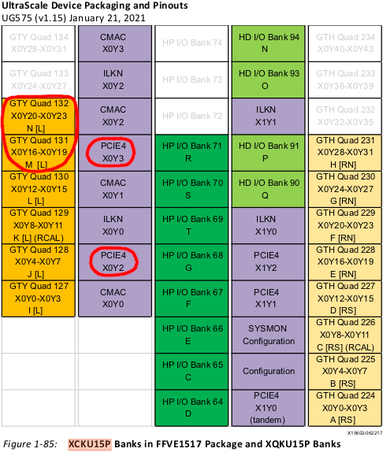
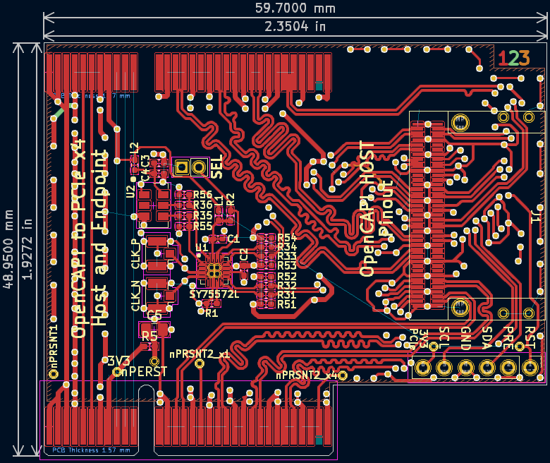
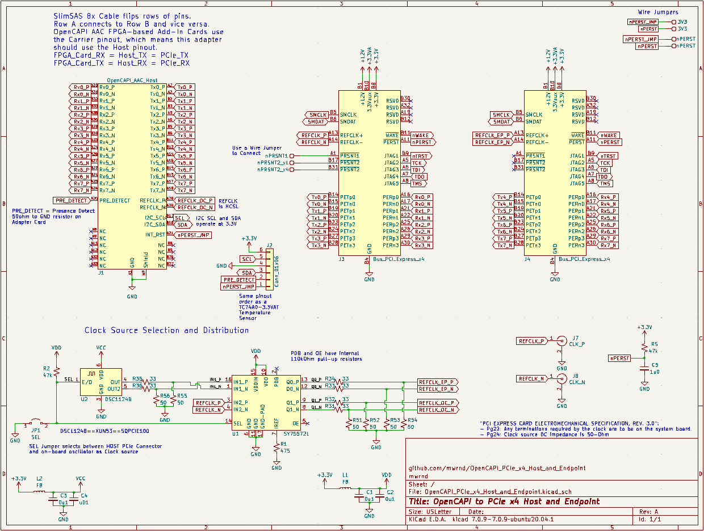

**Work-In-Progress**: [Gerbers ready but not yet ordered](https://github.com/mwrnd/OpenCAPI-to-PCIe_x4_Host_and_Endpoint/releases/tag/v0.1-alpha).

# OpenCAPI to PCIe x4 Host and Endpoint

Designed to test simultaneous PCIe Host and Endpoint operation with the Innova-2.

There are two [PCIE4](https://docs.xilinx.com/r/en-US/pg213-pcie4-ultrascale-plus/Introduction) blocks in the column of the Innova-2's OpenCAPI Quads.

[OpenCAPI](https://files.openpower.foundation/s/xSQPe6ypoakKQdq/download/25Gbps-spec-20171108.pdf)-compatible SlimSAS 8x uses a **Host** version of the OpenCAPI **Carrier** pinout from the [ADM-PCIE-9V5 User Manual (Pg15-19of38)](https://www.alpha-data.com/xml/user_manuals/adm-pcie-9v5%20user%20manual_v1_4.pdf).

# PCB Layout

All differential pairs are length-matched to within 1mm intra-pair (N-to-P) and each group of differential pairs (e.g., TX0-to-TX4) is similarly matched to within 1mm.

# Schematic

# Bill Of Materials

| Designator(s) | Part Number             | Quantity | Value      | Footprint                           | Availability                                                                                               |
| ------------- | ----------------------- | -------- | ---------- | ----------------------------------- | ---------------------------------------------------------------------------------------------------------- |
| U1            | SY75572LMG              |        1 |        N/A | QFN-16-1EP_3x3mm_P0.5mm             | [DigiKey](https://www.digikey.com/en/products/detail/microchip-technology/SY75572LMG-TR/5319585)           |
| U2            | DSC1124BI2-100-0000     |        1 |        N/A | OSC_SMD_IDT_JS6-6_5.0x3.2mm_P1.27mm | [DigiKey](https://www.digikey.com/en/products/detail/microchip-technology/DSC1124BI2-100-0000/5284202)     |
| J1            | U10A474240T             |        1 |        N/A | SlimSAS_8x_RA_U10-A474              | [DigiKey](https://www.digikey.com/en/products/detail/amphenol-cs-commercial-products/U10A474240T/17066204) |
| J2            | PPPC061LFBN-RC          |        1 |        N/A | PinHeader_1x06_P2.54mm_Vertical     | [DigiKey](https://www.digikey.com/en/products/detail/sullins-connector-solutions/PPPC061LFBN-RC/810178)    |
| JP1           | 2PH1-02-UA              |        1 |        N/A | PinHeader_1x02_P2.00mm_Vertical     | [DigiKey](https://www.digikey.com/en/products/detail/adam-tech/2PH1-02-UA/9830305)                         |
| R31 to R36    | RT0402FRE0733RL         |        6 |     33-Ohm | Resistor_SMD_R_0402_1005Metric      | [DigiKey](https://www.digikey.com/en/products/detail/yageo/RT0402FRE0733RL/1071963)                        |
| R51 to R56    | RT0402FRE0749R9L        |        6 |   49.9-Ohm | Resistor_SMD_R_0402_1005Metric      | [DigiKey](https://www.digikey.com/en/products/detail/yageo/RT0402FRE0749R9L/1072042)                       |
| R1            | RT0402FRE07475RL        |        1 |    475-Ohm | Resistor_SMD_R_0402_1005Metric      | [DigiKey](https://www.digikey.com/en/products/detail/yageo/RT0402FRE07475RL/1072032)                       |
| R2, R5        | RT0402FRE0751KL         |        1 |    51k-Ohm | Resistor_SMD_R_0402_1005Metric      | [DigiKey](https://www.digikey.com/en/products/detail/yageo/RT0402FRE0751KL/1072058)                        |
| L1, L2        | BLM15PX601SN1D          |        2 | 600@100MHz | Resistor_SMD_R_0402_1005Metric      | [DigiKey](https://www.digikey.com/en/products/detail/murata-electronics/BLM15PX601SN1D/4421102)            |
| C4            | KGM05AR71C103KH         |        1 |     0.01uF | Capacitor_SMD_C_0402_1005Metric     | [DigiKey](https://www.digikey.com/en/products/detail/kyocera-avx/KGM05AR71C103KH/563224)                   |
| C1, C2, C3    | KGM05AR51A104KH         |        3 |      0.1uF | Capacitor_SMD_C_0402_1005Metric     | [DigiKey](https://www.digikey.com/en/products/detail/kyocera-avx/KGM05AR51A104KH/563239)                   |
| C5            | CL21B105KAFNNNE         |        1 |        1uF | Capacitor_SMD_C_0805_2012Metric     | [DigiKey](https://www.digikey.com/en/products/detail/samsung-electro-mechanics/CL21B105KAFNNNE/3886724)    |
| J7, J8        | 2337019-1               |        2 | U.FL(UMCC) | U.FL_Hirose                         | [DigiKey](https://www.digikey.com/en/products/detail/te-connectivity-amp-connectors/2337019-1/9974052)     |
| Jumper        | SPN02SYBN-RC            |        1 |        N/A | 2mm Shunt                           | [DigiKey](https://www.digikey.com/en/products/detail/sullins-connector-solutions/SPN02SYBN-RC/927356)      |

**Optional**: [TC74Ax-3-3VAT](https://www.digikey.com/en/products/detail/microchip-technology/TC74A0-3-3VAT/442720) I2C Temperature Sensor for testing I2C.

# PCB Layer Stackup

4-Layer PCB stackup taken from [JLCPCB](https://jlcpcb.com/capabilities/pcb-capabilities).

Differential Impedance parameters were calculated using the [DigiKey Online Calculator](https://www.digikey.com/en/resources/conversion-calculators/conversion-calculator-pcb-trace-impedance).

